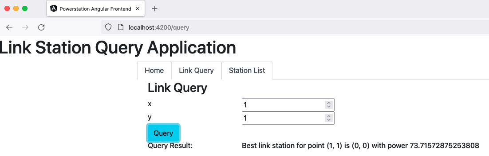
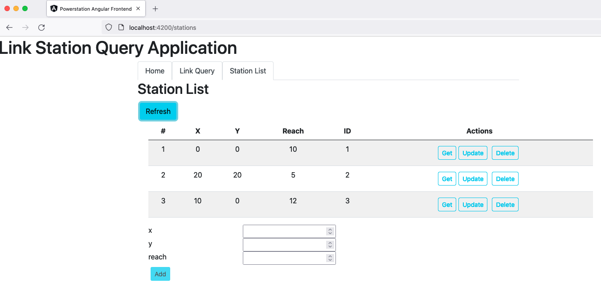
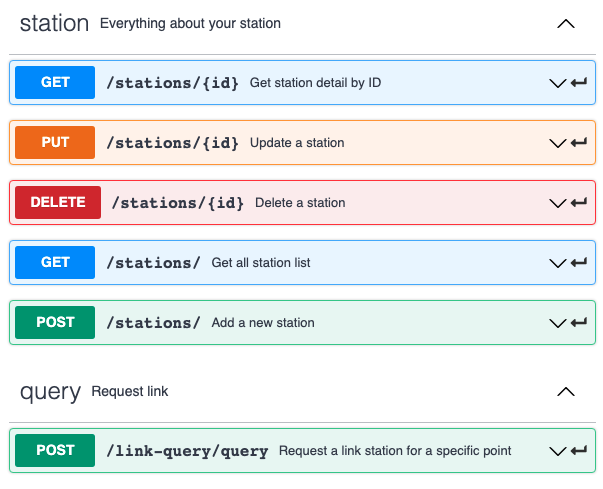
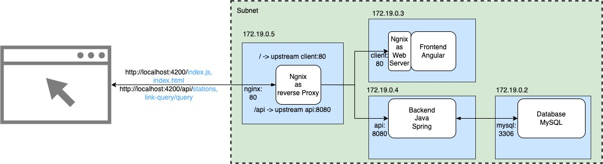

# Introduction
powerstation is an classic 3-tier web application (front-end: Angular, backend: Spring and database: MySQL) to allow user to perform query on specific point with the most suitable link station and remaining power. User can also perform full CRUD on the powerstations stored in the database.
Detail requirement refer to this document(/requirement.pdf)
- Query-Link

- Station CRUD


- Frontend-Backend REST API


###Used Tech Stack:
- Frontend:
    - HTTP Request w/ backend REST API
    - angular/router
    - nginx as webserver

- Backend:
    - Spring Boot
    - Spring Data REST
    - Spring REST Controller
    - Unit Test with JUnit5 and Mockito
    - SLF4J Logging

- Database:
    - SQL schema design
    - MySQL database and table creation
    - MySQL user administration

- Deployment:
    - Docker    
# How to Run
for local environment, download docker and execute following command in the same folder as 
```
docker-compose up
```

access frontend in browser via http://localhost:4200

# Architecture

# System Design

### Step 1: Requirements clarifications
- User can CRUD power station
- User can query with position

### Step 2: System interface definition
api/station:
GET
POST
UPDATE
DELTETE
api/link
POST

### Step 3: Back-of-the-envelope estimation
skipped


### Step 4: Defining data model

PowerStation
id INT
x INT
y INT
reach INT

linkQuery

linkResponse
string

### Step 5: High-level design
Classi 3-Tier
Front-End: Angular
Back-End: Spring
DataBase: MySQL

### Step 6: Detailed design

### Step 7: Identifying and resolving bottlenecks

The bottle neck is reading power station from database
- this is a read-heavy system
- try to cache! (cache strategy?)

# Other nice feature
- load balancing
- in-memory database as read cache
- travics CI integration
- cloud deployment
- k8s
